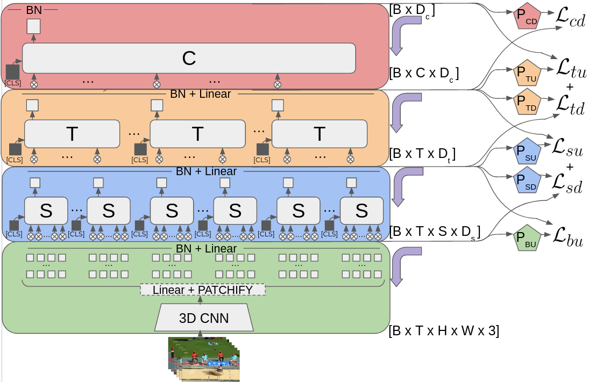

⚠️⚠️ DISCLAIMER!! ⚠️⚠️
**The ideas tested here have not been published in any paper. If you're interested on publishing these ideas, drop me an e-mail! I would love to collaborate!! I have many failed and to-be-tested ideas that we could build on!** (Find my socials on [my website](https://javierselva.github.io/)) Otherwise (i.e., you don't plan to publish), feel free to extend and play around as you wish, but I would love to know what things you find out! 

# Self-Supervised Hierarchical Video Transformer
This repository contains the PyTorch implemetation of some unfinished project I was working on towards the end of my PhD. I wanted to play around implementing and training video transformers with self-supervised learning. The architecture is based on a hierarchical Transformer implementation inspired by [ViViT](https://openaccess.thecvf.com/content/ICCV2021/papers/Arnab_ViViT_A_Video_Vision_Transformer_ICCV_2021_paper.pdf) (particularly on the Factorized Encoder), as well as the quite similar [STAM](https://arxiv.org/abs/2103.13915). With regards to the kind of self-supervised losses I was testing, they were heavily inspired in [SSVT](https://openaccess.thecvf.com/content/CVPR2022/papers/Ranasinghe_Self-Supervised_Video_Transformer_CVPR_2022_paper.pdf) and [Brave](https://openaccess.thecvf.com/content/ICCV2021/papers/Recasens_Broaden_Your_Views_for_Self-Supervised_Video_Learning_ICCV_2021_paper.pdf).


# Theory
The key idea is to try to extend Brave's local-global prediction, but instead of using separate networks, perform the bootstraping by trying to predict each level of the hierarchy from all other (inmediate) levels. This is further extended by training the model to predict future and past elements of the video to ensure temporal consistency learning. 



For example. The complete frame representation is trained by trying to make it able to predict a) upwards, i.e., a short clip representation to which the frame belongs; b) downwards, i.e., some random frame patches within that frame; and c) sideways, i.e., temporal prediction to the future or the past. In order to avoid shortcut solutions, it is crucial that information is not shared between frames or clips, and that's why I chose to use this type of architecture instead of others that seem to work better on their own, such as MViT or Swin, which share non-local information in the first (few) layers, making it trivial to the network to copy information. In summary: Patches predict frames, frames predict patches and clips, clips predict frames and the complete sequence representation, and the complete sequence representation predicts clips. Patches, frames and clips also predict temporally.


The intuition is that upward losses make representations aware of context, downward losses preserve local information within global representations, and sideways prediction ensures temporal dynamics are encoded.

However, to avoid information leaking to lower layers through backpropagation, each layer group (e.g., space, time...) has to be trained independently, as if it was a separate network. We tested several variations of this, but our main idea was using a separate optimizer for each group (spatial, temporal, clip...). Nevertheless, in general we observed great training unstability because of this. I think that my work is very similar to the later I-JEPA (see [my summary of the work here](https://javierselva.github.io/blog/paper-summary/2024/09/27/psum-IJEPA.html)), but this work from META AI uses a siamese setting instead, greatly avoiding these optimizing issues I was facing.

# Repo structure and relevant files
```
/anaconda_envs                   
|__ data_processing_env.yml  ## Includes relevant libraries for data pre-processing.
|__ pytorch2.yml             ## Main environment for the repo. 
|__ svt_pytorch.yml          ## Includes relevant libraries to run experiments with the [svt code](https://github.com/kahnchana/svt). 
/dockerfile
|__ Dockerfile               ## Dockerfile for the main project.
|__ Dockerfile.bak           ## Dockerfile for running visualization (tsne, umap...)
|__ pytorch_server.yml       ## pytorch2.yml was not workin in the server, so I used this one.
/run_scripts                 ## Scripts to run experiments from a docker image.
/architecture                ## Neural Net Models
|__ stam.py                  ## Generalized version of the [base transformer architecture](https://github.com/lucidrains/STAM-pytorch).
|__ ht.py                    ## General class for the hierarchical transformer.
|__ ht_mine.py               ## Custom Instance for HT, dedicated to the main idea of this repo.
|__ ht_vicreg.py             ## Custom Instance for HT, adapted for VICReg siamese setting.
/data_utils                  ## Data pre-processing and custom data-loaders.
/config                      ## Config files for defining experiment parameters.
|__ arch_config.yaml
|__ data_config.yaml
|__ train_config.yaml
|__ other custom files...
main.py                      ## Main training / eval loop.
losses.py                    ## Loss functions and logic.
eval.py                      ## Testing/Validation functions.
train.py                     ## Main training functions.
utils.py
visualization.py             ## TSNE and UMAP functions.
wandb_log.py
lancher.sh                   ## Script to launch main.py training.
launcher3.sh                 ## Script to launch visualization.py.
``` 

# Usage

## Installation
I used the anaconda environment to program and debug. I recommend trying out "*pytorch_env.yml*":
```bash
conda env create -f pytorch_env.yml
```

If, for some reason, that does not work for you, I had a different environment for the GPU server where I was running experiments (not sure why). The file is "*pytorch_server.yml*" within the *dockerfile* folder. However, I ended up using Docer for running experiments in the server:

```bash
cd dockerfile
docker build -t jselva/pytorch_new .
```

This creates a docker image which will call *launcher.sh* upon execution. You may change the name of the docker image, but then you may also need to replace it in the execution scripts.

## Data
Instructions for downloading the data depends on which you want to use. I've included some [relevant links below](#datasets) for the datasets I tested. Also, the */data_utils* folder includes some data-preprocessing code for each of those datasets. The code uses the paths contained in *config/data_config.yml*. These pre-processing steps require a different anaconda environment, namely "data_processing_env.yml" (I don't have a docker image for this one). Importantly, once the data has been processed and stored in *SAVE_PATH* (see *config/data_config.yml*), that's the same path used to load the data when training the models, so you don't need to change it between pre-processing and training (a bit confusing, I know).

## Training
I recommend calling *launcher.sh*:
```bash
chmod +x launcher.sh # only the first time
./launcher.sh 1 custom_example1.yaml
```

The first parameter is the GPU ID to be used (multi-gpu not implemented), and the second parameter is the custom config file to be used (must be contained within */config* folder.

Otherwise, you can directly run the docker with the same parameters (which will be passed to the *launcher.sh* script internally). First of all, make sure to edit the scripts within the *run_scripts* folder with appropriate paths within your system. These include: path to the data, path to the output where checkpoints are stored, path to the actual code (needed to find launcher.sh), and path to a temp folder for temporary files. These mappings allow the docker container to interact with the native hard-drive in your system.

```bash
cd run_scripts
chmod +x ./run_docker.sh # only the first time
./run_docker.sh 1 custom_example1.yaml
```

In this case you have to make sure that the *custom_example1.yaml* file contains the variable "model_name", as it is used to create the log file.


# Miscelanea
I cannot go into detail about all the options that the repo provides or various code details, but I want to mention some that could be relevant. If you struggle with any of these or any other detail of the code, raise an issue and I'll see how I can help :) 
 - **Data Loading**. I started working with [hdf5](https://www.hdfgroup.org/solutions/hdf5/) datasets, but this turned out to be terribly slow and heavy on the memory, so I tested out other options such as [decord](https://github.com/dmlc/decord), to not much avail. In the end, if you have SDD space available, the best option I could find to avoid a bottleneck was to actually pre-process the data and store each frame as an image, and then load the frames directly. Note this will take **a lot** of space, as you'll be storing raw uncompressed frames. However, I left all three dataloaders for use, but *data_handler_frames.py* is the only one to include some of the later features (see code for details).
 - **Config files**. There are three main (default) config files: *arch\_config.yaml*, *data\_config.yaml*, and *train\_config.yaml*. When calling *main.py* all three are loaded and compounded into a single python dictionary. If a custom config file is also provided (not necessarily including all config parameters), its values are loaded and used to replace those in the aforementioned dictionary, while the reamining parameters maintain the default values (some exceptions apply, see config files). I've left some random custom config files as an example.
 - **Logging and WandB**. At some point I dropped the console logging, so some features may work weird. In general, most logging is done through [WandB](https://wandb.ai/site/), for which you'll need a wandb key file to be included with the code for that to work. I have set up a weird logic to avoid logging to WandB when Debug is on, and I believe it could easily be adapted to set a flag that entirely deactivates this from a config parameter.
 - **Training loop**. The main traning loop in *main.py* does the following steps:
    - First train for some epochs in SSL fashion.
    - After appropriate number of steps, do a validation round with KNN (this was faster than performing a supervised training each time for validation).
    - Keep iterating in this fashion untill all epochs are completed.
    - Perform a final test round. For this, a set of supervised epochs are performed first, either by fine-tuning the whole model or fitting a few linear layers (probing), while freezing the rest of the model. Then perform a normal evaluation round.
 All this is adjustable through various config parameters. Note that for KNN and probing, the features for the whole dataset are pre-extracted first and stored in memory. In the case of probing, it is computed during the first epoch and re-used for all subsequent probing epochs. If memory is an issue, there's some logic for using HDF5 datasets instead (see */data_utils/precomputed_features.py*).
 - **Sweeps**. Before knowing about the sweep feature in wandb, I created my own, and *utils.py* includes a function that, from a given custom config file and a set of values for given parameters, generates one custom config file for each combination.
 - **Curriculum learning**. It allows to progressively complicate the model, starting from a pre-trained checkpoint. The key idea here was to first pre-train spatial modules only, and progressively add temporal layers. The logic in charge of this can be found in *main.py*, near the bottom. Basically, it creates a new config file based on the current one, but modifying the architecture and other relevant parameters (see commented out section at the bottom of *train_config.yaml* for an example), then loading the checkpoint for the previous step, adding new layers that are randomly initialized, and resuming training. This allows, for instance, to pre-train spatial layers on Image-net, then add temporal layers to be pre-trained on short videos, and finally add a clip layer that is able to learn from longer videos. Importantly, you have to make sure that a new training call is performed on the new config file that the code creates. See *run_experiments_CL.sh* for an example, you'd just need to create the first config file, and the rest should be created automatically when the first call finishes.
 - **Validation schedule**. During some period, I was seeing most of the change in the models at the beginning of training, for later plateauing. For this reason, I included an exponential validation regime that allows to wait increasingly more training epochs between validation rounds.
 - **Code cleanliness**. The code has not been cleaned, and it's in the same state it was left when I stopped working on this to write my thesis.


# Datasets
To test the model I played around with several datasets. Here are some relevant links:

- **ImageNet** (for image-only tests): https://www.kaggle.com/c/imagenet-object-localization-challenge/data
- **UCF101**: https://www.crcv.ucf.edu/data/UCF101.php
- **Kinetics-400**: Basically, the dataset is only a list of youtube videos with precise timestamps. I ended up using existing crawler repos that automatically download the data, but not sure which one. Basically, there's a complexity of either a) downloading the whole video then cropping the relevant portion, which may become problematic if you use multithreading to speed up the process, and extremelly time-consuming otherwise; or b) directly download the relevant parts. Henceforth, here are the two repos, it may be worthwhile reading the repos' issues with these problems in mind. 1) https://github.com/cvdfoundation/kinetics-dataset, 2) https://github.com/activitynet/ActivityNet/blob/master/Crawler/Kinetics/README.md.
- **SSv2**. Manually Downloaded from: https://www.qualcomm.com/developer/software/something-something-v-2-dataset. If I recall correctly you have to register (maybe with an institutional account) and download zips one by one.

# Attribution
Code-wise, this repository builds upon ViViT's unofficial repo: https://github.com/rishikksh20/ViViT-pytorch, 
as well as the quite similar STAM's unofficial repo: https://github.com/lucidrains/STAM-pytorch). Some of the data utilities where based on the ones from https://github.com/moliusimon/frnn. Part of the CNN architecture, and the convolutional experiments with S3D draw code from https://github.com/kylemin/S3D/blob/master/model.py and https://github.com/kylemin/S3D/blob/master/main.py. Part of the VicReg code was copied and adapted from https://github.com/facebookresearch/vicreg/blob/main/main_vicreg.py.